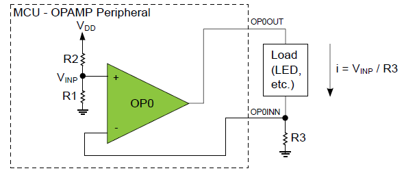

# Constant-Current Driver Using the Analog Signal Conditioning (OPAMP) Peripheral

  

A new feature introduced in the AVR® DB MCU is the Analog Signal Conditioning (OPAMP) peripheral. In this example, the OPAMP is used as a constant-current driver using a single external resistor. It can be used to drive a load such as LEDs, with constant current and not constant voltage. The OPAMP peripheral also provides the ability to adjust the current setting under firmware control. The configuration for this example can be seen in the figure above. For more information about setup and code, see the [application note](https://microchip.com/DS00003632).

## Related Documentation

* [AN3632 - Constant-Current Driver Using the Analog Signal Conditioning (OPAMP) Peripheral](https://microchip.com/DS00003632)
* [AVR128DB48 Curiosity Nano User Guide](https://www.microchip.com/DS50003037)
* [AVR128DB48 Device Page](https://www.microchip.com/wwwproducts/en/AVR128DB48)

## Software Used

* [Microchip Studio](https://www.microchip.com/mplab/avr-support/atmel-studio-7) 7.0.4002 or later
* Microchip Studio AVR-Dx_DFP version 1.6.76 or later
* For the MCC based MPLAB X version of this project, please go to [this repository](https://github.com/microchip-pic-avr-examples/avr128db48-constant-current-driver-using-opamp-mplab-mcc)
  
## Hardware Used

* [AVR128DB48 Curiosity Nano](https://www.microchip.com/DevelopmentTools/ProductDetails/PartNO/EV35L43A)
* One resistor (value dependent on desired current)
* Load (LED, etc)

## Demo Configuration
* Connect the load, such as an LED, between PD2 (OP0OUT) and PD3 (OP0INN) as shown in the schematic above
* Connect a resistor, R3, from PD3 (OP0INN) to GND. The value of R3 determines the amperage of the constant current. For instance, using R3 = 205Ω will yield a current of 1mA with this example implementation. See the [application note](https://microchip.com/DS00003632) for more information on how to configure R3 to produce a constant current with a specific amperage.
* To change the constant current level value in firmware inside Microchip Studio, go to *Project* and select *Re-Configure Atmel Start Project* to open START inside the IDE. Select the *OPERATIONAL_AMPLIFIER* componenet and scroll down to the *OPAMP0 SETTINGS*. Use the drop down menu on the *MUXWIP: Multiplexer for Wiper Multiplexer* setting to change the amperage of the constant current according to the formula described in the [application note](https://microchip.com/DS00003632). 

## Running the Demo in Microchip Studio
* Connect the AVR128DB48 Curiosity Nano to a computer using a USB cable
* Download the *.zip file or clone the example to get the source code
* Open the *.atsln file with Microchip Studio
* Press *Start Without Debugging* (CTRL+ALT+F5) to build and program the device in order to run the application

## Conclusion
After going through this example you should have a better understanding of how to set up the OPAMP peripheral as a constant current driver with a specific amperage for a load.

